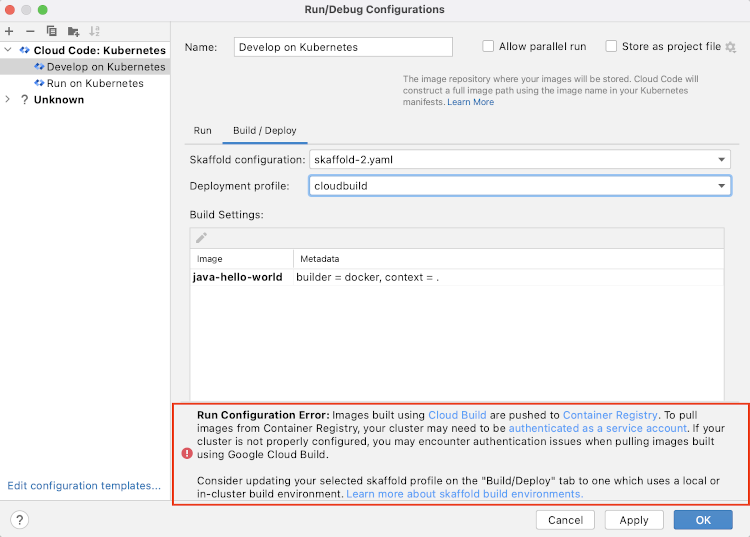
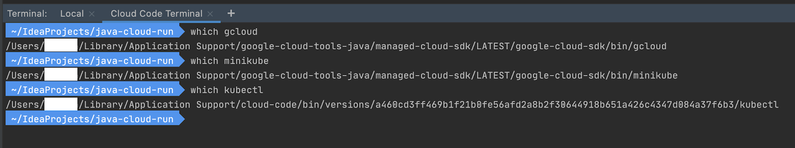
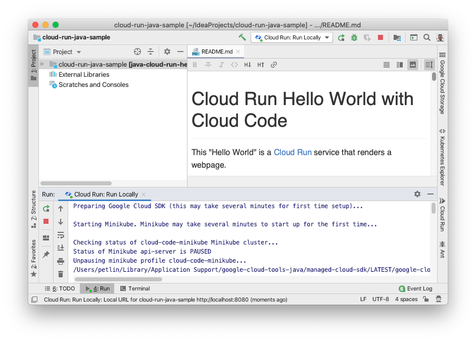
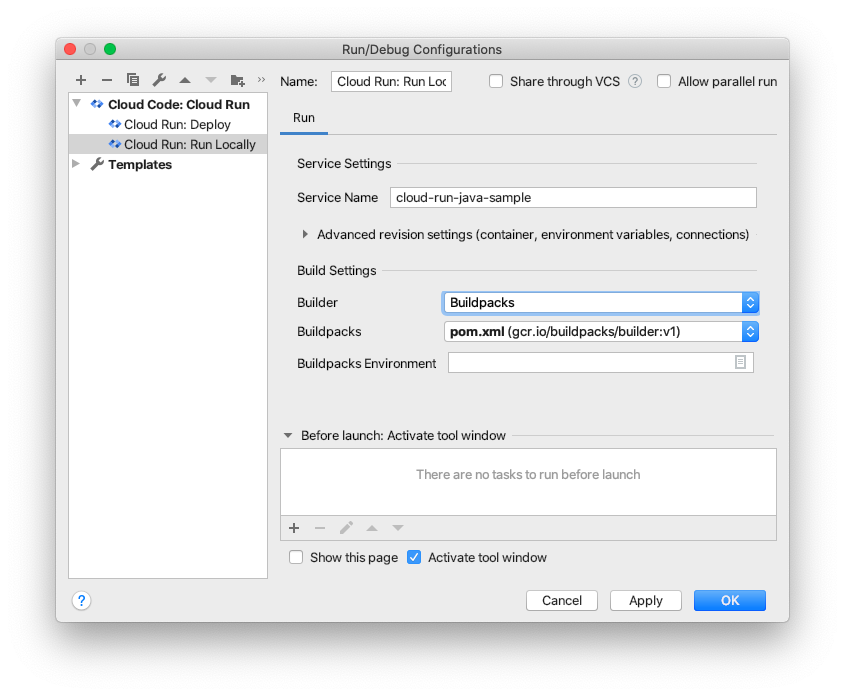
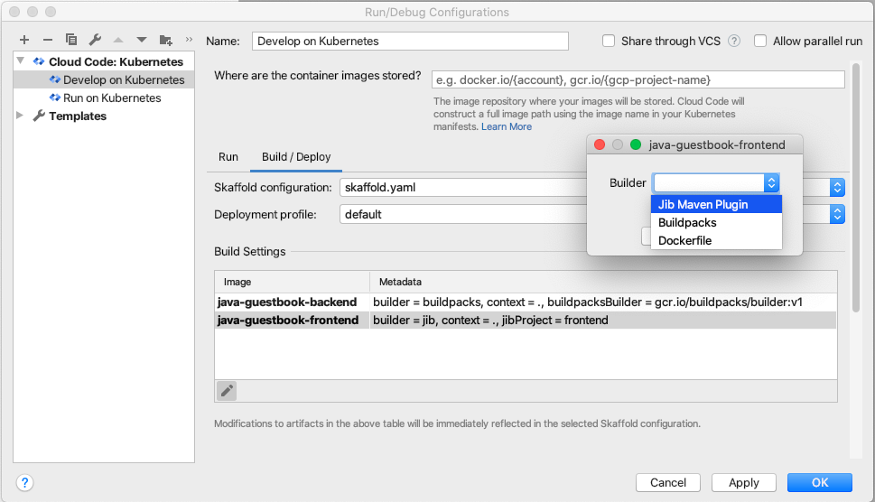
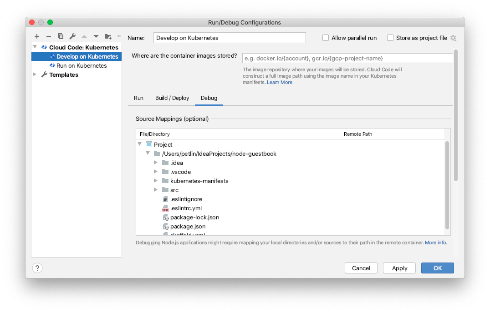
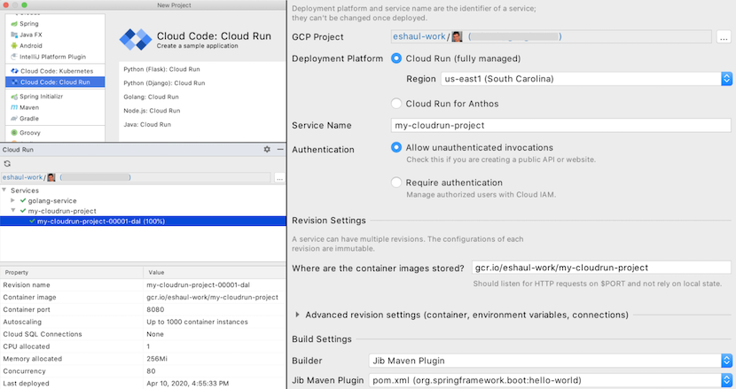
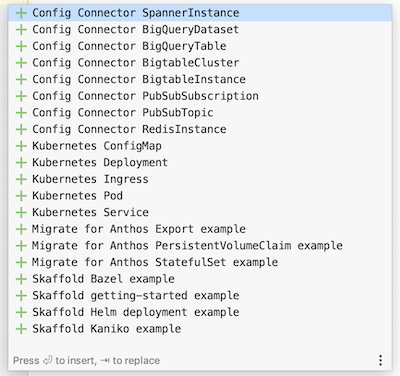

# Release notes
This page documents production updates to Cloud Code for IntelliJ. You can check this page for announcements about new or updated features, bug fixes, known issues, and deprecated functionality.

## Version 21.12.1

**Note**: This is the final release that contains Cloud Code updates for IntelliJ version 2020.3. Starting next release Cloud Code will support versions 2021.1 and above. See our [version support policy](https://cloud.google.com/code/docs/intellij/version-support) for more details.

### New Features
- **Artifact Registry Support**: Easily configure your Kubernetes and Cloud Run deployments to use Artifact Registry to store your container images.

  
  

- **Apply changes "On Demand"**: Instead of rebuilding and redeploying your application on every file save, you can now configure "On Demand" watch mode to apply changes only when you are ready. Configure "On Demand" watch mode in the run configuration settings and trigger a reload by clicking the >> trigger button or the "Alt+Control+," / "Command+Option+," shortcut.

  
  

- **Iterate on code while debugging**: You can now make changes to, and iterate on, your source code while debugging your Kubernetes or Cloud Run locally emulated applications! Set the watch mode in the run configuration to “On Demand”, and Cloud Code will apply the changes to the running container without terminating your debug session.

### Updates
- Removed the “Run on Kubernetes” run configuration during the creation of newly cloned samples. Use the “Develop on Kubernetes” run configuration for developing your Kubernetes apps.

### Bug Fixes
- Fixed SkaffoldConfigurationDetector.addVirtualFileListener already disposed. [#2982](https://github.com/GoogleCloudPlatform/cloud-code-intellij/issues/2982)
- Fixed regex parsing bug which caused CloudApi searches to throw errors. [#3036](https://github.com/GoogleCloudPlatform/cloud-code-intellij/issues/3036)

## Version 21.11.2-IB.1 - [Cloud Code Insiders](https://cloud.google.com/code/docs/intellij/insiders) Release

### New Features
- **Artifact Registry Support**: Easily configure your Kubernetes and Cloud Run deployments to use Artifact Registry to store your container images.

  
  

- **Apply changes "On Demand"**: Instead of rebuilding and redeploying your application on every file save, you can now configure "On Demand" watch mode to apply changes only when you are ready. Configure "On Demand" watch mode in the run configuration settings and trigger a reload by clicking the >> trigger button or the "Alt+Control+," / "Command+Option+," shortcut.

  
  

- **Iterate on code while debugging**: You can now make changes to, and iterate on, your source code while debugging your Kubernetes or Cloud Run locally emulated applications! Set the watch mode in the run configuration to “On Demand”, and Cloud Code will apply the changes to the running container without terminating your debug session.

### Updates 

- Removed the “Run on Kubernetes” run configuration during the creation of newly cloned samples. Use the “Develop on Kubernetes” run configuration for developing your Kubernetes apps.

## Version 21.11.1

### New Features
- **Microservice development**: Cloud Code introduces module based application deployment through [Skaffold modules](https://cloud.google.com/code/docs/intellij/skaffold-modules) that helps developers to iterate on a part of the application rather than deploying your entire application. Configure the set of modules in the Run Configuration UI under the “Build / Deploy” tab. Try out one of the Cloud Code Kubernetes Guestbook sample applications to see it in action by clicking File -> New -> Project -> Cloud Code: Kubernetes. 

  

### Updates 
- Cloud Code release notes are now easier to access within the plugin - the release notes have better formatting and are now displayed within the Cloud Code Welcome page (visit Tools > Cloud Code > Help / About > About Cloud Code…).

### Bug Fixes
- Fixed a GitServiceException: 'origin/master' is not a commit and a branch 'origin/master' cannot be created from it. [#3016](https://github.com/GoogleCloudPlatform/cloud-code-intellij/issues/3016)
- Fixed an issue where attempting to set a Kotlin breakpoint incorrectly asks user if they want to set a Java breakpoint. [#3009](https://github.com/GoogleCloudPlatform/cloud-code-intellij/issues/3009) 

## Version 21.10.1

### New Features
- **Support for 2021.3 EAP**: Cloud Code now supports the latest Early Access Preview (EAP)! Please file any issues you encounter on our [GitHub repository](https://github.com/GoogleCloudPlatform/cloud-code-intellij/issues/new).
- **Support for Cloud Deploy YAML Editing**: Cloud Code now offers editing support for [Cloud Deploy configuration files](https://cloud.google.com/deploy/docs/config-files). The plugin offers suggestions and auto-completions that make it easier to set up your [Cloud Deploy](https://cloud.google.com/deploy) delivery pipeline.
- **Support for Kptfile Editing**: Cloud Code now supports [Kpt](https://kpt.dev/) users with editing support for [Kptfiles](https://kpt.dev/book/02-concepts/01-packages). The plugin offers suggestions and auto-completions that make it easier to configure your kpt package.

### Bug Fixes
- Fix crash in App Engine validation due to App Engine components not being installed. [#2939](https://github.com/GoogleCloudPlatform/cloud-code-intellij/issues/2939)
- Fix StackOverflowPreventedExceptions due to isValid leading to endless recursion. [#2972](https://github.com/GoogleCloudPlatform/cloud-code-intellij/issues/2972)
- Fix issue where multi document Skaffold configuration files were not parsed correctly.

## Version 21.9.2

### New Features
- **Insiders Channel**: You can now try pre-release features, provide feedback, and ask the Cloud Code team and other insiders questions by [installing pre-release builds](https://cloud.google.com/code/docs/intellij/insiders#get) and joining the [Cloud Code Insiders group](https://groups.google.com/g/cloud-code-insiders). Become a Cloud Code Insider by enabling the setting on the Cloud Code welcome screen, or in the Cloud Code settings (Preferences > Tools > Cloud Code).

  

- **New and Improved Kubernetes Logging Experience**: Your Kubernetes development sessions now have a vastly improved logging experience!
  - See exactly which task is executing, and the status of each task.

    

  - View the full session logs, or drill down into an individual task helping you quickly identify errors.

    

  - Stream your application logs at the container level.

    

### Bug Fixes
- Fixes a bug where the plugin would uninstall instead of update when a user followed the IntelliJ prompt to update to 21.9.1.
- Fixed bug where Cloud Code language server integration was referencing an Intellij project that had already been disposed of. [#2974](https://github.com/GoogleCloudPlatform/cloud-code-intellij/issues/2974)
- Fix for NullPointerException parsing skaffold yaml configuration.  [#2975](https://github.com/GoogleCloudPlatform/cloud-code-intellij/issues/2975)
- Fix “Invalid File” Throwable thrown from the language server. [#2966](https://github.com/GoogleCloudPlatform/cloud-code-intellij/issues/2966)
- Removed redundant empty space in the Kubernetes dependency settings panel.
- Fixed bug where Kubernetes deployment to managed minikube did not honor a custom kubeconfig file selection.
- Fixed bug where AppEngine run configuration registration was intermittently run on the wrong thread.
- Fixed bug where skaffold.yaml files with multiple yaml documents in them were not correctly parsed by kubernetes run configurations.
- Fixed bug where slow skaffold operations were run in the UI thread.

## Version 21.7.1

### New Features
- **Updated Welcome Screen**: Reorganizes the welcome screen content to help users better understand what they can use the plugin for.

  

- **Support for 2021.2 EAP**: Cloud Code now supports the latest Early Access Preview (EAP)! Please file any issues you encounter on our [GitHub repository](https://github.com/GoogleCloudPlatform/cloud-code-intellij/issues/new).

### Bug Fixes
- Fixes an issue with high CPU usage when editing skaffold.yaml, causing IDE to freeze [#2952](https://github.com/GoogleCloudPlatform/cloud-code-intellij/issues/2952)
- Fixes a Cloud Debugger NPE caused by calling the Git plugin on the UI thread [#2915](https://github.com/GoogleCloudPlatform/cloud-code-intellij/issues/2915)

## Version 21.6.1

### New Features
- **Skaffold profile creation**: Create new Skaffold profiles from within your IDE. This feature is particularly useful if you’re using an M1 Mac and would like to deploy to a GKE cluster; create a profile with a “Cloud Build” build environment to build and deploy from your machine with the confidence that your images will work in an x86 cluster.

  

  

- **Skaffold profile filtering**: Users can now filter for Skaffold profiles with a particular build environment. If you have profiles using multiple build environments, you can easily find all the profiles that use a particular build environment. This feature is particularly useful if you want to build your images locally during development but in-cluster or via Google Cloud Build for production.

  

- **Artifact Registry Support**: Now automatically authenticates artifact registry repository urls when uploading container images.

### Updates
- **Simplified creation of Kubernetes sample application**: Removed the image repository prompt that was previously displayed to users in the New Project wizard when creating a Kubernetes sample application.

### Bug Fixes
- Fixed a bug where prompts to install the appropriate language plugin for a selected sample app weren’t displayed when creating a new sample-based project (e.g. the Flask Kubernetes Hello World sample now prompts you to install the python plugin).

## Version 21.5.1

### New Features
- **Python Debugging**: You can now debug your Python applications running on Kubernetes and in the local Cloud Run emulator! Set breakpoints and step through your code. No more debugging via logs or having to manually configure remote debugging.

  

### Updates
- Adds a progress indicator while attempting to bootstrap a project for Kubernetes support.
- Modularize pieces of our managed Cloud SDK installation for faster dependency installs.
- Cloud Run deployment settings no longer disable the local build option on ARM architectures to allow selection of supported builders (e.g. Jib, for Java applications).
- Updated our Plugin Marketplace text with more relevant and helpful information.

### Bug Fixes
- Fixed various exceptions occurring during Skaffold schema upgrade checks.
- Fixed a bug where the “Build Settings” pane under the “Build / Deploy” tab in the Kubernetes run configuration doesn’t properly refresh itself.
- Fixed a TimeoutException occurring during the editor `kubectl apply` gutter action. [#2894](https://github.com/GoogleCloudPlatform/cloud-code-intellij/issues/2894)

## Version 21.4.1

**Note**: This is the final release that contains Cloud Code updates for IntelliJ version 2020.1. Starting next release Cloud Code will support versions 2020.2 and above. See our [version support policy](https://cloud.google.com/code/docs/intellij/version-support) for more details.

### New Features
- **Kubernetes deployment to managed minikube**: Cloud Code now provides a separate option to always deploy locally to minikube. Cloud Code will manage minikube, installing and starting it, or re-using your existing minikube cluster, and starting or un-pausing minikube before each deployment as needed.

  

- **Cloud Run support for Cloud Build and messaging for M1 Mac users**: For Cloud Run deployments, users can now choose between building their images on Cloud Build or locally. For M1 Mac users the option to build images for Cloud Run locally is disabled because Cloud Run is currently only able to run x86_64 images. Note: we haven't yet updated our docs to reflect these changes as we're looking at surfacing ARM specific docs in a clearer manner, please stay tuned (and follow [#2891](https://github.com/GoogleCloudPlatform/cloud-code-intellij/issues/2891) for ARM related updates).

  

- **Kubernetes deployment compatibility checks**: On the Kubernetes run configuration panel, Cloud Code makes a best-effort attempt to notify users if the cluster they’ve targeted for deployment has any incompatibilities with the environment in which they plan to build the image(s) being deployed (e.g. locally, Cloud Build, or in-cluster).

  

- **New contextual actions in Kubernetes Explorer**: Create and deploy Kubernetes sample applications, bootstrap and run an existing Kubernetes application, open help resources.

  

- **New contextual actions in Cloud Run tool window**: Create and deploy a new Cloud Run sample application, bootstrap currently open projects for local Cloud Run development, open help resources.

  

- **New right click action in the explorer**: Remove a cluster and its associated contexts from the kubeconfig

  

### Updates

- **Updated Kubernetes run configuration UI**: It now matches IDE guidelines and improves usability.

  

- **Multiple improvements for Cloud Run tool window**: Show a region next to a service name, more friendly prompts when no services exist yet or Cloud Run API is not enabled.
- **Cloud API improvements**: See all available API categories expanded by default for easier browsing and searching. Hyperlinks to libraries and documentation now show tooltips with their URLs.
- **Custom Samples Rebranding**: Custom Templates have been rebranded to Custom Samples. We currently do not support custom application templating, but will consider adding the functionality in the future based on feedback.
- **Dynamic Plugin**: Cloud Code is dynamic starting with IDE version 2021.1 and no longer requires IDE restart to be installed or updated.

### Bug Fixes

- Copying Kubernetes resource names using a keyboard shortcut now works properly for Kubernetes Explorer [#2898](https://github.com/GoogleCloudPlatform/cloud-code-intellij/issues/2898)
- Fixed a frequent InvocationTargetException IDE error thrown in 2021.1 [#2889](https://github.com/GoogleCloudPlatform/cloud-code-intellij/issues/2889)

## Version 21.3.1

### New Features
- **Initial support for M1-based Apple Silicon Macs**: With this update, you can now build and work locally on your M1 Mac with Cloud Code, minikube, and Skaffold for ARM64 targets. Please note that [Rosetta 2](https://support.apple.com/en-us/HT211861) is currently required as several dependencies are still x86/64 only, refer to [instructions](https://cloud.google.com/code/docs/intellij/arm). Follow this [GitHub issue](https://github.com/GoogleCloudPlatform/cloud-code-intellij/issues/2891) for more information and to track the latest updates.
- **New Secret Manager Actions**: Secret Manager now comes with more actions, such as enabling, disabling, and destroying secret versions, giving you greater flexibility to manage secrets within your IDE. Within the Secret Manager panel, under the Versions tab, right-click any secret version to access these actions. For a detailed look, see the [Managing secrets guide](https://cloud.google.com/code/docs/intellij/secret-manager).

  
  

### Updates
- Reorganized the Cloud Code settings panel to be more intuitive. All CLI dependencies required for Cloud Code can now be found in the Tools > Cloud Code > Dependencies settings panel.

  
- Added support for specifying a VPC Connector when deploying to Cloud Run (fully managed). [#2885](https://github.com/GoogleCloudPlatform/cloud-code-intellij/issues/2885)
- Added actions for viewing documentation and creating new sample applications to the Kubernetes and Cloud Run explorers.

  
  

### Bug Fixes
- Fixed a crash that could occur when listing Secret Manager secrets. [#2882](https://github.com/GoogleCloudPlatform/cloud-code-intellij/issues/2882)
- Fixed crashes that could occur when using the Cloud Run local emulator. [#2852](https://github.com/GoogleCloudPlatform/cloud-code-intellij/issues/2852), [#2830](https://github.com/GoogleCloudPlatform/cloud-code-intellij/issues/2830)
- Fixed timeout errors when trying to view Cloud Run services with the API not enabled. [#2851](https://github.com/GoogleCloudPlatform/cloud-code-intellij/issues/2851)
- Fixed a crash that could occur when trying to use Custom Templates with invalid certificates. [#2902](https://github.com/GoogleCloudPlatform/cloud-code-intellij/issues/2902)

## Version 21.2.3 

**Note:** This is the last release containing Cloud Code updates for IntelliJ version 2019.3. Starting next release Cloud Code will support versions 2020.1 and up. See our [version support policy](https://cloud.google.com/code/docs/intellij/version-support) for more details.

### New Features
- **GKE Autopilot**: You can now deploy your application to GKE Autopilot right from IntelliJ Cloud Code configurations. GKE Autopilot is a new mode of operation of GKE clusters where infrastructure is auto managed by Google, provides auto provisioning and auto scaling of GKE infra to the end user. Overview of [GKE Autopilot](https://cloud.google.com/kubernetes-engine/docs/concepts/autopilot-overview).
- **Kubernetes YAML Gutter Actions**: Support for dry runs on the client and server, directly applying yaml files, and viewing the differences between a YAML file in source control and a deployed YAML file.

  

### Updates
- Added a link to the Google Cloud Storage console browser from the side panel explorer. Please comment on [#2802](https://github.com/GoogleCloudPlatform/cloud-code-intellij/issues/2802) if you would like additional enhancements to this feature.

### Fixes
- Fixed a bug where Kubernetes sessions were not automatically terminated on error, requiring the user to click the stop button. [#2837](https://github.com/GoogleCloudPlatform/cloud-code-intellij/issues/2837)
- Fixed a crash during base64 decoding of secrets. [#2846](https://github.com/GoogleCloudPlatform/cloud-code-intellij/issues/2846)

## Version 21.2.2 (EAP only)

### Fixes
- [Issue #2880](https://github.com/GoogleCloudPlatform/cloud-code-intellij/issues/2880) Fixed bug that caused Cloud Code to crash when starting on 2021.1 EAP

## Version 21.2.1

### New Features
- **Custom templates:** You can now create applications from custom templates! Cloud Code offers the option of importing a Git template repository so that teams can get started quickly from a standard set of starter applications, services, and infrastructure configuration best suited to your technical stack and organizational policies. To add a custom template, go to **Settings** > **Cloud Code**. To read more about custom templates and how to set them up, head over to the [setting up a template repository](https://cloud.google.com/code/docs/intellij/set-up-template-repo) guide.

  

  

### Updates
- **Support for 2021.1 EAP:** Cloud Code now supports the latest Early Access Preview (EAP)! Please file any issues you encounter on our [GitHub repository](https://github.com/GoogleCloudPlatform/cloud-code-intellij/issues/new).

- **New sample application READMEs:** When you create a new sample application with Cloud Code, the new README gives updated guidance on next steps to help you get more out of Cloud Code.

- **Cloud Run:** Cloud Run managed deploys now support an 8 GiB memory option for any deployments with at least 2 CPUs allocated. This option is available in Cloud Run managed run configurations under **Advanced revision settings** > **Memory allocated**.

  

### Fixes
- [Issue #2872](https://github.com/GoogleCloudPlatform/cloud-code-intellij/issues/2872) Fixed bug requiring a Dockerfile when running a Cloud Run application locally with a buildpacks build.
- Fixed bug where user images in project selector were no longer being displayed.
- Cloud SDK progress dialog now defaults to the background instead of a modal when the IDE starts.

## Version 21.1.1

### New Features
- **Kubernetes Deployment Status Check:** This new flag allows you to control health checks performed by Skaffold for Kubernetes deployments. You can now skip health status checks for deployed Kubernetes resources when you don't need Cloud Code to wait for deployments to stabilize.

  

## Version 20.12.2

### New Features
- **Cloud Code Terminal:** Allows you to access Cloud Code managed dependencies such as the Cloud SDK (gcloud), minikube, and skaffold via the IDE's built in terminal. Launch it via the Tools menu under **Cloud Code > Tools > Cloud Code Terminal**.

    

### Updates
- Auto-populate Cloud Run service region list using `gcloud run regions list`. This ensures that users will never see an out-of-date list of available Cloud Run service regions.
- Improve spacing in Cloud Run service details panel. The “Property” column was taking up more space than necessary.
- Added support for network proxies when installing managed Cloud SDK. To configure proxies, use IDE Preferences | Appearance & Behavior | System Settings | HTTP Proxy settings.

### Fixes
- [Issue #2818](https://github.com/GoogleCloudPlatform/cloud-code-intellij/issues/2818), [Issue #2853](https://github.com/GoogleCloudPlatform/cloud-code-intellij/issues/2853): Fixed an issue where Dockerfiles were not found during a Cloud Run Local run when they were not located in the root directory of a project.
- [Issue #3062](https://github.com/GoogleCloudPlatform/cloud-code-intellij/issues/3062): Fixed an issue where Cloud Run services were being listed multiple times in the Cloud Run tool window.
- [Issue #2838](https://github.com/GoogleCloudPlatform/cloud-code-intellij/issues/2838), [Issue #2841](https://github.com/GoogleCloudPlatform/cloud-code-intellij/issues/2841): Improved managed Cloud SDK reliability.

## Version 20.12.1

### Fixes
- [Issue #2855](https://github.com/GoogleCloudPlatform/cloud-code-intellij/issues/2855), [Issue #2858](https://github.com/GoogleCloudPlatform/cloud-code-intellij/issues/2858): Fixed an issue affecting IntelliJ 2020.3 IDEs causing Kubernetes development sessions to fail at initialization due to updates in the platform's dependencies.

## Version 20.10.1

### New Features
- **Secret Manager support:** Many applications require credentials to connect to a database, API keys to invoke a service, or certificates for authentication. Cloud Code now integrates with Google Cloud's Secret Manager to make it easy to create, view, update, and use secrets from within your IDE so you can keep this sensitive data out of your codebase and keep your applications secure. 
  - View secrets, their versions, permissions, and properties in the Secret Manager panel. Easily leverage secrets from your application using our step-by-step guide in the “Code” tab.
  
    

  - Create secrets by either right-clicking highlighted text within the editor and selecting **Create Secret in Secret Manager…**, or by clicking the **+** button in the Secret Manager panel.
  
    
    
  - Leverage the Google Cloud libraries browser to enable the Secret Manager API and import the Secret Manager client library in order to access secrets in your application.
  
    

- **Revamped Google login experience**: Login state is now synced between your IDE and command line, allowing you to log in through either.
- Cloud Code configures Cloud SDK [Application Default Credentials](https://cloud.google.com/sdk/gcloud/reference/auth/application-default) when you log in through your IDE to enable a seamless Google API authentication experience when developing locally (including Minikube and the Cloud Run local emulator), without you needing to download service account files or manually configure environment variables.

### Updates
- Reorganized the **Tools > Cloud Code** menu to make Cloud Code actions easier to find.

  
  
- Removed the Google account management component from the main IDE toolbar. Use a project selector or the **Tools > Cloud Code** menu to sign in and out of Google Cloud.
- Improved **Cloud Run (fully managed)** support:
  - Deploy Cloud Run services from your IDE to these newly added regions. View the full supported list [here](https://cloud.google.com/run/docs/locations):
    - `asia-east2` (Hong Kong)
    - `asia-northeast3` (Seoul, South Korea)
    - `asia-southeast2` (Jakarta)
    - `asia-south1` (Mumbai, India)
    - `europe-west2` (London, UK)
    - `europe-west3` (Frankfurt, Germany)
    - `europe-west6` (Zurich, Switzerland)
    - `southamerica-east1` (São Paulo, Brazil)
  - Allocate up to 4 vCPUs to container instances with the increased limit.
  - Allocate up to 4GiB of memory to your services with the increased quota.

### Fixes
- [Issue #2827](https://github.com/GoogleCloudPlatform/cloud-code-intellij/issues/2827): Fixed an issue where Cloud Code previously prompted to upgrade to an older version of the Skaffold schema.

## Version 20.9.1
**Note:** Cloud Code now supports the 2020.3 EAP. 

### New Features
- Kubernetes Explorer support for cluster addition: Add in existing Google Kubernetes Engine (GKE) clusters with the Cloud Code Kubernetes Explorer.

  

  

- Automatic Skaffold schema upgrades: Cloud Code detects Skaffold schemas that aren’t up-to-date and prompts (via the Event Log) when a Skaffold schema version upgrade is available for existing Skaffold YAML configuration files.

  

- Alternatively, navigate to Tools > Cloud Code > Kubernetes and select the Check for Skaffold Schemas Upgrades menu item to check for available schema upgrades.

  
  
- Spring GCP Java Libraries for Cloud APIs: Choose between recommended Google Client Java Libraries and Spring GCP Java libraries for all supported Cloud APIs with the Manage Google Cloud APIs dialog.

  

### Updates
- Cloud Code Welcome and Release Notes screens now allow creating new sample applications for Cloud Run and Kubernetes.

  

- The list of available APIs within the Manage Google Cloud APIs dialog is now searchable.

  

- Cloud Code provides documentation links for all supported languages for a selected Cloud API.

  

- Improved presentation for builders in Cloud Run and Kubernetes run configurations.

  

- Cloud Run Explorer and Kubernetes Explorer have their root node expanded by default, making it easier to see the Kubernetes cluster list and Cloud Run services list.

  
  
### Fixes

- Fixed Cloud Run checks to ensure the presence of all required components when a custom Cloud SDK is used. 
- Improved Cloud Run deployment logs.
- Improved user experience for project selection dialog.

## Version 20.8.2

### Updates 
- Adds a notification when Git is not installed on the machine when cloning a Cloud Code sample instead of throwing an error. 

## Version 20.8.1
**Note:** The minimum supported platform version has been increased to 2019.3.

### New Features
- Develop and debug your Cloud Run application locally with the new `Cloud Run: Run Locally` run configuration. In addition to deploying your applications to Cloud Run, you can now iterate on the applications locally in a Cloud Run-like environment.
 
  
\
  
- Build your Kubernetes and Cloud Run container images with Cloud Native Buildpacks for easy containerization; no Dockerfile required!
\
  
- Enhanced Skaffold artifact builder configurability when bootstrapping projects or modifying Kubernetes run configuration settings. Easily select between available builders such as Jib (for Java projects), Docker, or buildpacks.
\
  
- Improved debugging support for Node.js applications with the ability to configure the mapping between the local path of your sources to their remote path in the container.
\
  
- Cloud Code now supports validation, documentation on hover, and code completions for hundreds of popular Kubernetes Custom Resource Definitions (CRDs). You can also configure additional CRD locations and access CRDs from the current Kubernetes context.
\
  

### Updates
- Improved UI for deployment to Cloud Run for Anthos, and better messaging for exposing deployed services. Fields such as cluster and region will now auto-populate with the available options. 
- Improved error messages throughout the plugin with clearer wording and more actionable suggestions.
- Added Cloud Run deployment configuration options to the UI, including minimum and maximum number of instances, timeout, and concurrency.
- Improved logging for the output console and Event Logs.

### Fixes
- Fixed various binary forward compatibility issues throughout the plugin by building with the minimum supported version of the plugin.
- Fixed bug where deployments did not delete on finishing when the option was selected.
- Fixed issue where Skaffold status check was not configurable through an environment variable.

## 20.6.1

**Note to 2020.2 EAP users**: we previously released version 20.5.1 with support for the latest EAP. We have since uncovered some compatibility issues that need to be worked through for an optimal experience, and are therefore removing support for the EAP in this release. Expect a new release as soon as possible supporting the 2020.2 EAP.

### Fixes

- Fixed an OOM error coming from the Kubernetes Explorer.
- Fixed a NoSuchFileException that occurred when using the Kubernetes explorer with no ‘.kube’ folder.
- Fixed a NoSuchMethodError coming from the Skaffold notification.
 
## 20.5.1

**Note**: In the next release we plan to bump the minimum supported platform version to 2019.3. If you are on 2019.2, we recommend that you upgrade so that you will continue to get Cloud Code updates.

### New Features

- You can now grab an interactive terminal into pods and containers from the Kubernetes Explorer. This feature is available for IDE versions 2019.3 and later.
\
  
- The Kubernetes Explorer now maintains its state through refreshes so that you don’t lose your location in the tree.
- The Kubernetes Explorer now automatically updates its state on changes so that you are immediately aware of changes to your cluster without having to manually refresh.

### Updates 

- Hovering over a Pod in Kubernetes Explorer will display more information from the Conditions Array of the Pod Status.

### Fixes 

- Fixed an `IllegalStateException: Duplicate Key` error with App Engine causing some Gradle projects to not properly import.

## 20.4.3

### Fixes

- Fixes cases where Cloud Code run configurations are not automatically created in non-IDEA JetBrains IDEs (PyCharm, GoLand, WebStorm)
- Fixes cases where Kubernetes run configurations’ state in non-IDEA JetBrains IDEs cannot be stored

## 20.4.2

This is a patch release following the 20.4.1 release adding Cloud Run support earlier this week.

### Fixes

- Fix for NoClassDefFoundError loading JavaSdk class mainly in PyCharm IDEs
- Fix for NoClassDefFoundError loading GradleSettings class

## 20.4.1

We are pleased to announce [Cloud Run](https://cloud.google.com/run) support in Cloud Code for IntelliJ!

Cloud Code now makes it easy to deploy your services to Cloud Run fully managed or Cloud Run for Anthos on GKE. You can view your deployed services right in the IDE with the Cloud Run Explorer.

Follow the [Cloud Run quickstart guide](https://cloud.google.com/code/docs/intellij/quickstart-cloud-run), and use our built-in templates to get started quickly. Please file any feature requests or issues you encounter on our [GitHub repo](https://github.com/GoogleCloudPlatform/cloud-code-intellij/issues/new)!

### New Features

- **Cloud Run** support in IntelliJ and JetBrains IDEs
  - **Cloud Run starter templates** in Java, Node.js, Go, and Python to help you get started quickly
  - **Deploy your Cloud Run services** directly from the IDE to Cloud Run fully managed or Cloud Run for Anthos on GKE
  - **Browse your deployed Cloud Run services** without leaving the IDE with the built-in Cloud Run Explorer
- Configure the log verbosity setting for the Skaffold output in the Kubernetes Run Configurations

### Updates 

- Improved UI for setting the default image repository in the Kubernetes Run Configurations 
- Improved proxy support - the Kubernetes Explorer now respects configured IntelliJ proxy settings

## 20.2.1

### New Features

- **Enhanced Client Library Browser**. Now with a much improved UI, and support for more languages including Java, Python, Node.js, and Go! View available Google Cloud APIs, enable an API, view API status (enabled or disabled), and install client libraries to consume an API, all from within your IDE. Access via Tools > Cloud Code > Add Cloud Libraries and Manage Cloud APIs  
\
  
- **Revamped Image Path UX**. For Kubernetes projects, Cloud Code now ships with a significantly improved user experience for setting the image path (e.g. `gcr.io/{gcp-project-name}`). The field will even help suggest a path for you, if possible, based on your current active context.
\
  
- **Automatically created Kubernetes Run Configurations**. When cloning a Cloud Code Kubernetes sample project from the new project wizard, the Kubernetes run configurations are now automatically created, instead of requiring a click on a notification.

### Bug Fixes
- **Kubernetes Project Detection**. Fixed an issue with the Kubernetes project detection notification where accepting the prompt to create the run configurations didn’t do anything.
- **2020.1 EAP**. Incremental fixes to support the latest 2020.1 EAP including a frequent runtime error: `window with id="Google Cloud Storage" isn't registered`. 
- Fixed a language client IllegalStateException: `java.lang.IllegalStateException: completionItem.insertText must not be null`.

## 20.1.3

Patch release following the 20.1.2 release of Cloud Code.

### Bug Fixes

- Fix backwards compatibility bug in the Kubernetes template wizard causing the missing language plugin warning to throw runtime errors in IntelliJ 2019.1
- Fix backwards compatibility bug in the Kubernetes template wizard causing the project name suggestion logic to throw runtime errors in IntelliJ 2019.2 and lower by rolling back the change

## 20.1.2

### New Features

- Easily view the YAML of a resource in your Kubernetes cluster right from the Kubernetes Explorer. Just navigate to a resource in the Kubernetes Explorer, such as a Pod, right click and select “View Remote YAML” 
\
  
- You can now re-open the welcome screen to view release notes and plugin details. Select: Tools > Cloud Code > Open Welcome Screen
- The plugin now works in the latest 2020 EAP version of IntelliJ (and other Jetbrains IDEs)
- You can now view the versions of the plugin-managed dependencies (including Skaffold and Kubectl) from the settings under Settings > Cloud Code > Kubernetes

### Updates

- The Kubernetes sample project wizard now suggests an appropriate project title instead of `untitled*` 
- The Kubernetes samples project wizard will now suggest that you install the language plugin corresponding to the selected template if it is not already installed

## 20.1.1

### New Features

- Adds a new Cloud Code Kubernetes setting to toggle the Kubernetes editing features on or off for compatibility with other plugins that provide overlapping support. Accessible under “Settings > Cloud Code > Kubernetes”.

### Bug Fixes

- Fixes `NoSuchMethodError at KubernetesSettingsConfigurable.disposeUiResources` caused by incorrect coroutine `cancel` invocation.
- Fixes possible UI thread freezes by using a more lightweight approach for detecting Skaffold configuration files.

## 19.12.1

This release improves stability and support for the recently released version 2019.3 of IntelliJ and JetBrains family of IDEs.

### Bug Fixes

- Fixes intermittent errors loading Kubernetes samples from Cloud Code’s New Project wizard.
- Fix for `It's prohibited to access index during event dispatching` exception that occurs occasionally when cloning a Kubernetes sample.
- Catches IndexOutOfBounds exception in Cloud Code’s editing support when trying to convert an LSP position to an out of bounds document offset in the IDE.

## 19.11.3

We are pleased to announce that Cloud Code is now GA!

### Bug Fixes

- Updating Skaffold version provided by the dependency manager to 1.0.1 to fix issue with the cloudbuild profile using the sample projects.

## 19.11.2

This release fixes several bugs and improves stability of the Cloud Code plugin. It also contains the GA version of Skaffold, and enhancements to YAML editing support.

### New Features

- **Skaffold is now GA.** Skaffold, the Kubernetes development CLI tool that powers several features of Cloud Code, [is now generally available](https://cloud.google.com/blog/products/application-development/kubernetes-development-simplified-skaffold-is-now-ga). Cloud Code’s automatic dependency manager now includes the GA version of Skaffold.
- **Snippets for more types of configuration files.** Cloud Code can now assist you with editing your Config Connector and Cloud Build configuration files:
\
  

### Bug Fixes

- Updated GCP login to use the new endpoint URL.

## 19.11.1

Note: This release updates the Kubernetes Run Configurations with new names and improved setting controls. Depending on your version of IntelliJ, you may be prompted to have your existing Cloud Code run configurations automatically converted to the new format. **Important: if you are running IntelliJ version 2019.2 through 2019.2.2, then you will likely have to update your IDE to the latest version to open existing Cloud Code projects (see a [IDEA-218071](https://youtrack.jetbrains.com/issue/IDEA-218071)) from the welcome screen.**

### New Features

- **Add alternate kubeconfig files.** If your workflow includes additional kubeconfig files, you can now select them for use in the Cloud Code plugin. They will then be recognized for deployment and cluster browsing:
\
  
- **Configure Migrate for Anthos easily.** Cloud Code can assist you with editing your Migrate for Anthos configuration files:
\
  
- **Add Kubernetes support for your Jib Java projects.** With one click, the “Add Kubernetes Support” menu action can quickly add Cloud Code Kubernetes support for your projects that use Jib to build container images.
- **Browse your CRDs.** The Kubernetes Cluster browser now includes a node for viewing your Custom Resource Definitions:
\
  
- **View the status of your Kubernetes deployments.** Kubernetes deployments now display status information and replica counts in the Cluster browser:
\
  
- **Debug your Go Applications in-cluster.** Cloud Code comes with one-click debugging of your Golang applications running in Kubernetes clusters:
\
  

### Bug Fixes

- Fixed a bug where loading your available CSR (Cloud Source Repositories) repos resulted in an error.
- Fixed an issue where a login failure resulted in an exception. An error message is now shown.

## 19.10.1

This release fixes several bugs and improves stability of the Cloud Code plugin. It also contains enhancements to the Kubernetes Cluster Browser, including the ability to view containers in your pods and stream logs from them.

### New Features

- You can now drill down into your pods to view your containers. Stream logs directly from a running container.
\
  
- New option to pin your Kubernetes deployments to whatever is set as your system-wide current context.
\
  
- Copy Kubernetes resource names to the clipboard by right-clicking on a node in the Kubernetes Cluster Browser.
- Refresh any Kubernetes resource individually to update its state.

### Bug Fixes

- Fixes a NPE caused by Maven-aware code for displaying a notification suggesting Spring Cloud GCP for Spring projects using GCP APIs.
- Fixes an issue where the Cloud Code dependency installer could be stuck in a broken state, blocking Kubernetes deployments and debugging.
- Fixed an exception that could occur during LSP initialization due to invalid document listener state.

## 19.9.2

### New Features

Cloud Code's Kubernetes support is now in Beta! This release includes many new features for Kubernetes developers:

- Browse your Kubernetes clusters right from your IDE. View your pods, deployments, services and other resources. Stream logs and describe resources. View > Tool Windows > Kubernetes Explorer.
\
  
- Cloud Code will now automatically install key Kubernetes dependencies for you, including [Skaffold](https://skaffold.dev/docs/) and [Kubectl](https://kubernetes.io/docs/tasks/tools/install-kubectl/), helping you get up and running quickly. Configure managed dependencies under Settings > Cloud Code > Kubernetes.
\
  
- Enhanced editing support in all JetBrains IDEs for various configuration files such as Cloud Build, Kustomize, and Kubernetes. See errors highlighted in your config, and view quick documentation (see the [help pages](https://www.jetbrains.com/help/idea/viewing-reference-information.html#inline-quick-documentation) for more details including how to enable docs on mouse move). 
\
  
- Cloud Code now comes with Kubernetes starter templates in Java, Python, Node.js, and Go to help you quickly get started. File > New Project ... > Cloud Code Kubernetes.
\
  

### Bug Fixes
- Cloud Code will now execute the Skaffold process from the directory containing the Skaffold configuration file, fixing relative path issues for multi-service projects.
- Skaffold configuration files will now validate properly when the JetBrains Kubernetes plugin is also installed.

## 19.9.1

- Kubernetes deployment events in the event log now show more detailed and structured output for locally port-forwarded services, including service name and namespace.

## 19.7.2

### New Features
- Kubernetes deployments now show clickable hyperlinks in the Event Log for quick access to locally port-forwarded services. [2611](https://github.com/GoogleCloudPlatform/google-cloud-intellij/issues/2611)

### Bug Fixes
- Fix for Google Cloud Storage exception caused by an illegal document offset value. [2491](https://github.com/GoogleCloudPlatform/google-cloud-intellij/issues/2491)

## 19.7.1

### New Features
- Config-free debugging of containers in any Kubernetes cluster for Node.js, in addition to Java and Kotlin. [2514](https://github.com/GoogleCloudPlatform/google-cloud-intellij/issues/2514)
- Enhanced Kubernetes deploy and debug status output in the event log. [2567](https://github.com/GoogleCloudPlatform/google-cloud-intellij/issues/2567)
- Kubernetes deployment output log colorization. [2460](https://github.com/GoogleCloudPlatform/google-cloud-intellij/issues/2460)

### Updates
- Support IntelliJ platforms version 2019.2. [2571](https://github.com/GoogleCloudPlatform/google-cloud-intellij/issues/2571)

### Bug Fixes
- Fix for allowing multiple simultaneous Kubernetes debug sessions. [2554](https://github.com/GoogleCloudPlatform/google-cloud-intellij/issues/2554)
- Fix for displaying correct missing dependency messages in the Kubernetes run configurations. [2586](https://github.com/GoogleCloudPlatform/google-cloud-intellij/issues/2586)
- Fix for IllegalStateException caused by missing Kubernetes context. [2606](https://github.com/GoogleCloudPlatform/google-cloud-intellij/issues/2606)
- Fix for Stackdriver Debugger NPE. [2232](https://github.com/GoogleCloudPlatform/google-cloud-intellij/issues/2232)

## 19.5.3

### Updates
- Explicitly enable port-forwarding on all Kubernetes commands since it is now opt-in for Skaffold. [2562](https://github.com/GoogleCloudPlatform/google-cloud-intellij/issues/2562)

## 19.5.2

### Bug Fixes
- Fixes issue where unsupported 'cleanup' flag is passed from the 'Deploy to Kubernetes' run configuration to the Skaffold run command. [2556](https://github.com/GoogleCloudPlatform/google-cloud-intellij/issues/2556)
- Fixes potential UI freeze in the Kubernetes settings panel, and fixes increased CPU usage on some Linux platforms caused by a script reading the shell environment PATH. [2548](https://github.com/GoogleCloudPlatform/google-cloud-intellij/issues/2548)
- Shows appropriate warning message in the Kubernetes run configurations if 'kubectl' is not found on the PATH. [2551](https://github.com/GoogleCloudPlatform/google-cloud-intellij/issues/2551)

## 19.5.1

This release introduces many bug fixes and stability improvements as well as some exciting new 
features in Cloud Code to improve the Kubernetes development experience.

### New Features
- **Java Kubernetes debugging**. Debug your Java Kubernetes applications as if they were running locally. Set breakpoints, step through code, etc., all against a live Kubernetes cluster running locally, on GKE, or on one of the cloud providers.
- **Kubernetes application bootstrapping**. Do you already have an existing Kubernetes application? It is now even easier to get started using Cloud Code. The plugin will detect your Kubernetes application and auto-create the Skaffold configuration for you so that you immediately develop and deploy.
- **Enhanced Kubernetes deployment**. The deployment and continuous development experience is now vastly improved. For instance, you can select the cluster you are deploying to right from the IDE, set environment variables, configure if your deployments are cleaned up after continuous development, and more.

### Bug Fixes
- Fix to system shell environment loading which potentially could hang the IDE during Kubernetes deployment. [2482](https://github.com/GoogleCloudPlatform/cloud-code-intellij/issues/2292) 
- Fix NPE in App Engine local run. [2239](https://github.com/GoogleCloudPlatform/cloud-code-intellij/issues/2239) 
- Gracefully terminate Skaffold process when IntelliJ is force quit. [2419](https://github.com/GoogleCloudPlatform/cloud-code-intellij/issues/2419) 

## 19.4.1

Introducing Cloud Code for IntelliJ, formerly known as Cloud Tools for IntelliJ.

Cloud Code provides a set of tools for working with [Kubernetes](https://kubernetes.io/) and the [Google Cloud Platform](https://cloud.google.com/). The plugin makes working with Kubernetes feel like editing and debugging local code, and integrates with various Google Cloud products to simplify your development process.

### New Features
[Kubernetes Support](https://github.com/GoogleCloudPlatform/google-cloud-intellij/tree/master/kubernetes)
- Kubernetes deployment support - easily deploy your applications to Kubernetes from the IDE
- Kubernetes continuous deployment - set up a local development workflow where the plugin monitors your code for changes and surfaces the changes live on a cluster, just like a local development server, except with the fidelity of running on a Kubernetes cluster
- Tail logs from your containers
- Support for editing [Skaffold](https://github.com/GoogleContainerTools/skaffold) configuration files - Skaffold powers the deployment experience

## 19.2.1

 - Miscellanous bug fixes [2292](https://github.com/GoogleCloudPlatform/google-cloud-intellij/issues/2292) [2326](https://github.com/GoogleCloudPlatform/google-cloud-intellij/issues/2326) [2320](https://github.com/GoogleCloudPlatform/google-cloud-intellij/issues/2320)
 - Fixes project selection when a malformed project with no name set is present [2332](https://github.com/GoogleCloudPlatform/google-cloud-intellij/issues/2332)

## 19.1.2

### Fixed
  - Fixed ClassCastException in deprecated App Engine Runtime inspection. [2322](https://github.com/GoogleCloudPlatform/google-cloud-intellij/issues/2322)

## 19.1.1

Users of App Engine Java 7 runtime should migrate to Java 8: https://cloud.google.com/appengine/docs/deprecations/java7

### Added
  - Inspection and quickfix for usage of deprecated App Engine java runtime. [2314](https://github.com/GoogleCloudPlatform/google-cloud-intellij/issues/2314)

## 18.12.1

### Fixed
  - Fixed error reporting for IDEA 2018.2+ [2303](https://github.com/GoogleCloudPlatform/google-cloud-intellij/pull/2303)
  - Fixed Cloud SDK auto-management UI thread bug for IDEA 2018.3. [2304](https://github.com/GoogleCloudPlatform/google-cloud-intellij/issues/2304)

## 18.11.1

### Added
  - Added support for IDEA 2018.3 [2279](https://github.com/GoogleCloudPlatform/google-cloud-intellij/issues/2279)

## 18.10.1

### Added
  - Stackdriver Debugger now works with Kotlin projects. [2253](https://github.com/GoogleCloudPlatform/google-cloud-intellij/issues/2253)

### Fixed
  - Fixed IDE exception when Cloud SDK version cannot be parsed. Showing a notification instead. [2259](https://github.com/GoogleCloudPlatform/google-cloud-intellij/issues/2259)
  - Fixed NoSuchMethodError on jdom.Element#detach during legacy App Engine facet migration. [2255](https://github.com/GoogleCloudPlatform/google-cloud-intellij/issues/2255)
  - Fixed issue with Stackdriver Debugger where it would not remember the last Cloud Project selection across multiple run configurations. [2266](https://github.com/GoogleCloudPlatform/google-cloud-intellij/issues/2266)

## 18.8.1

### Added
  - Users can now manage Google Cloud APIs, create service accounts with custom roles in all Jetbrains IDEs, including PyCharm, GoLand, PhpStorm, WebStorm, and others. [2182](https://github.com/GoogleCloudPlatform/google-cloud-intellij/issues/2182)

### Fixed
  - Fixed GCP project selector look and feel for IDEA 2018.2. [2237](https://github.com/GoogleCloudPlatform/google-cloud-intellij/issues/2237)

## 18.7.1

### Added
  - Users can now deploy Gradle based projects with Community Edition and the app-gradle-plugin. [2105](https://github.com/GoogleCloudPlatform/google-cloud-intellij/issues/2105)
  - Environment variables needed for Google Cloud APIs are now added automatically to plain Java run configurations. [2148](https://github.com/GoogleCloudPlatform/google-cloud-intellij/issues/2148)

### Fixed
  - Fixed appengine-web.xml generation to work properly with Maven and Gradle based projects including spring-boot projects. [1948](https://github.com/GoogleCloudPlatform/google-cloud-intellij/issues/1948)

## 18.6.1

### Fixed
  - Fixed errors in the managed Cloud SDK caused by downgrading the version. [666](https://github.com/GoogleCloudPlatform/appengine-plugins-core/issues/666)
  - Fixed error in the managed Cloud SDK caused by "HEAD" in the version file. [561](https://github.com/GoogleCloudPlatform/appengine-plugins-core/issues/561)

## 18.5.2

Google Cloud Tools for IntelliJ is now available in PyCharm (Community and Professional). Browse your GCS buckets, and interact with Cloud Source Repositories from PyCharm. More IDEs coming soon.

### Changed
  - Updated description on plugin repository web page to indicate IDE feature breakdown. [2150](https://github.com/GoogleCloudPlatform/google-cloud-intellij/issues/2150)

## 18.5.1

Google Cloud Tools for IntelliJ is now available in PyCharm (Community and Professional). Browse your GCS buckets, and interact with Cloud Source Repositories from PyCharm. More IDEs coming soon.

### Added
  - Refactored plugin so that language agnostic features (Cloud Storage, Cloud Source Repos) are available in other JetBrains IDEs besides IDEA. [1896](https://github.com/GoogleCloudPlatform/google-cloud-intellij/issues/1896)

### Changed
  - The managed Cloud SDK will no longer be installed on each IDE load after the first manual cancellation. [2113](https://github.com/GoogleCloudPlatform/google-cloud-intellij/issues/2113)

### Fixed
  - Fixed exception in 2018.2 EAP. [2124](https://github.com/GoogleCloudPlatform/google-cloud-intellij/issues/2124)

## 18.4.1

### Added
  - Let the Google Cloud Tools plugin manage the Google Cloud SDK for you - including download, installation, and updates. No longer any need to manually download the SDK. [673](https://github.com/GoogleCloudPlatform/google-cloud-intellij/issues/673)
  - Mitigate dependency version conflicts with built in Google Cloud Java BOM support. Includes auto-adding the BOM when adding google client libraries, plus pom.xml inspections to help manage dependency version conflicts. [1921](https://github.com/GoogleCloudPlatform/google-cloud-intellij/issues/1921) 
  - Automatically add required environment variables to App Engine local run configurations for locally accessing Google Cloud APIs.  [1917](https://github.com/GoogleCloudPlatform/google-cloud-intellij/issues/1917)
  
## 18.3.2
  - Fixed bug causing plugin initialization error on versions less than 2017.3. [1972](https://github.com/GoogleCloudPlatform/google-cloud-intellij/issues/1972)

## 18.3.1

### Added
  - Added ability to create service accounts and download service account keys from the IDE client library workflow. [1808](https://github.com/GoogleCloudPlatform/google-cloud-intellij/issues/1808)
  
### Fixed
  - Fixed cases where appengine-web.xml wasn't being generated due to missing web.xml. [1903](https://github.com/GoogleCloudPlatform/google-cloud-intellij/issues/1903)

## 18.2.1

### Added
  - Added Google Cloud Java client library discovery and addition from the IDE. [1806](https://github.com/GoogleCloudPlatform/google-cloud-intellij/issues/1806)
  - Added ability to enable Google Cloud APIs from the IDE. [1807](https://github.com/GoogleCloudPlatform/google-cloud-intellij/issues/1807)
  
### Changed
  - Updated the cloud project selector with a greatly improved user experience. [1719](https://github.com/GoogleCloudPlatform/google-cloud-intellij/issues/1719)
  - Updated the cloud project selector so that the last selection is remembered and defaulted. [1812](https://github.com/GoogleCloudPlatform/google-cloud-intellij/issues/1812)

### Fixed
  - Fixed missing App Engine standard local run artifacts. [1625](https://github.com/GoogleCloudPlatform/google-cloud-intellij/issues/1625)

## 18.1.1

### Fixed
  - Fixed broken error reporting mechanism. [1842](https://github.com/GoogleCloudPlatform/google-cloud-intellij/issues/1842)

## 17.12.2

### Fixed
  - Fixed broken analytics property setup causing dropped analytics. [1773](https://github.com/GoogleCloudPlatform/google-cloud-intellij/issues/1773)

## 17.12.1

The Google Account plugin has now been merged into the Cloud Tools plugin and is no longer a separate installation. If you previously had the Account Tools plugin installed, follow the new dialog prompt to remove it and restart the IDE to ensure that you don't experience any issues.

### Fixed
  - Fixed out of memory error when typing and searching for multiple projects in the cloud project 
    selector. [1742](https://github.com/GoogleCloudPlatform/google-cloud-intellij/issues/1742)
    
### Changed   
  - The Google Account plugin is now integrated into the Google Cloud Tools plugin. A separate 
    Google Account plugin installation is no longer required. [1735](https://github.com/GoogleCloudPlatform/google-cloud-intellij/issues/1735)

## 17.11.1

### Added
  - Google Cloud Storage (GCS) integration in IntelliJ. You can now browse your GCS buckets 
    and view their contents without leaving the IDE. [1696](https://github.com/GoogleCloudPlatform/google-cloud-intellij/issues/1696)
  - Searching and filtering capabilities in the cloud project selector. [1660](https://github.com/GoogleCloudPlatform/google-cloud-intellij/issues/1660)
  - New 'add App Engine framework support' tools menu shortcut to provide another way to add App 
    Engine support to a project. [1685](https://github.com/GoogleCloudPlatform/google-cloud-intellij/issues/1685)
  
### Fixed
  - Fixed App Engine region indicator status message when no cloud project has been selected. [1607](https://github.com/GoogleCloudPlatform/google-cloud-intellij/issues/1607)

## 17.9.2

Java 8 on App Engine standard environment is now [generally available](https://cloudplatform.googleblog.com/2017/09/Java-8-on-App-Engine-Standard-environment-is-now-generally-available.html).

### Changed
  - Updated the new App Engine standard project wizard to generate Java 8 applications by default.
    [1641](https://github.com/GoogleCloudPlatform/google-cloud-intellij/issues/1641)

## 17.9.1

### Added
  - Added the ability to change the name of the staged artifact for App Engine flexible deployments.
    [1610](https://github.com/GoogleCloudPlatform/google-cloud-intellij/issues/1610)

### Changed
  - App Engine flexible deployment configurations now default to deploy the artifact as-is, without
    renaming to `target.jar` or `target.war`. [1151](https://github.com/GoogleCloudPlatform/google-cloud-intellij/issues/1151)
  - Updated the name of the placeholder artifact name in the generated Dockerfile templates to make 
    it clearer that it needs to be updated by the user. [1648](https://github.com/GoogleCloudPlatform/google-cloud-intellij/issues/1648) 
  - App Engine standard deployment configurations now default to update dos, dispatch, cron, queues,
    and datastore indexes. [1613](https://github.com/GoogleCloudPlatform/google-cloud-intellij/issues/1613)
  - Native projects that add support for Cloud Endpoints Frameworks for App Engine will now use
    Endpoints V2. [1612](https://github.com/GoogleCloudPlatform/google-cloud-intellij/issues/1612)

### Fixed
  - Fixed the `Deployment source not found` error when deploying Maven artifacts.
    [1220](https://github.com/GoogleCloudPlatform/google-cloud-intellij/issues/1220)
  - Fixed the scale of the user icon on HiDPI displays.
    [1633](https://github.com/GoogleCloudPlatform/google-cloud-intellij/issues/1633)
  - Fixed an issue where the plugin was downgraded on the IDEA 2017.3 EAP.
    [1631](https://github.com/GoogleCloudPlatform/google-cloud-intellij/issues/1631)

## 17.8.2 

### Fixed
  - Fixed "Error: invalid_scope" issue when logging in with your Google Account. [1598](https://github.com/GoogleCloudPlatform/google-cloud-intellij/issues/1598)

## 17.8.1

### Added
  - Added a feedback & issue reporting link to the Google Cloud Tools shortcut menu. [1560](https://github.com/GoogleCloudPlatform/google-cloud-intellij/issues/1560)

### Changed 
  - Users can now save deployment run configurations that are partially completed or in an error state. [1407](https://github.com/GoogleCloudPlatform/google-cloud-intellij/issues/1407)

### Fixed
  - Fixed registered Docker language conflict causing issues running plugin alongside .ignore plugin. [1535](https://github.com/GoogleCloudPlatform/google-cloud-intellij/issues/1535)
  - Fixed NPE parsing Stackdriver Debugger breakpoint timestamps. [1537](https://github.com/GoogleCloudPlatform/google-cloud-intellij/issues/1537)
  - Removed EAR as acceptable App Engine artifact type for local dev server runs. [1190](https://github.com/GoogleCloudPlatform/google-cloud-intellij/issues/1190)
  - Deployments are now displayed across multiple IDE windows. [1432](https://github.com/GoogleCloudPlatform/google-cloud-intellij/issues/1432)
  - Fixed crash caused by attempting to modify a read-only collection. [1571](https://github.com/GoogleCloudPlatform/google-cloud-intellij/issues/1571)

## 17.6.2

### Fixed
  - Fixed NPE occurring when there is a local dev server configuration but no standard facet. [1525](https://github.com/GoogleCloudPlatform/google-cloud-intellij/issues/1525)

## 17.6.1

### Added
  - App Engine flexible facet with app.yaml and Dockerfile configuration. [1514](https://github.com/GoogleCloudPlatform/google-cloud-intellij/issues/1514)
  - App Engine flexible framework support detection. [1277](https://github.com/GoogleCloudPlatform/google-cloud-intellij/issues/1277)
  
### Changed 
  - Allow user to specify a Docker directory instead of just a Dockerfile for flexible deployments. [1304](https://github.com/GoogleCloudPlatform/google-cloud-intellij/issues/1304)
  - Refresh the user experience of the deployment dialog (both standard and flexible). [1477](https://github.com/GoogleCloudPlatform/google-cloud-intellij/issues/1477)
  
### Fixed
  - Fixed Google avatar size for HiDPI displays. [1391](https://github.com/GoogleCloudPlatform/google-cloud-intellij/issues/1391)

## 17.2.5_2017

### Added
  - Environment variables in the App Engine standard local run configuration are now passed in to the dev server. [#1364](https://github.com/GoogleCloudPlatform/google-cloud-intellij/issues/1364)
  - Environment variables configured in appengine-web.xml are now honored and passed in to the dev server. [#377](https://github.com/GoogleCloudPlatform/appengine-plugins-core/issues/377)

## 17.2.4_2017

### Added
  - Added a checkbox to deploy all App Engine config files during service deployment. [#1346](https://github.com/GoogleCloudPlatform/google-cloud-intellij/issues/1346)

## 17.2.3_2017

### Changed
  - Removed the Clear Datastore flag from the App Engine standard local development server configuration since the current version of the server doesn't support it. ([#1345](https://github.com/GoogleCloudPlatform/google-cloud-intellij/issues/1345))

## 17.2.2_2017

### Fixed
  - Invalid Java Runtime Environment (JRE) on 
staging an App Engine standard app ([#1316](https://github.com/GoogleCloudPlatform/google-cloud-intellij/issues/1316)):

        > Unable to stage app: Cannot get the System Java Compiler. Please use a JDK, not a JRE.

## 17.2.1

Happy New Year Cloud Tools for IntelliJ users! This year's first release is primarily a maintenance
release. If you are having authentication problems using Cloud Source Repositories and our 
plugin, check out [this possible solution](https://github.com/GoogleCloudPlatform/google-cloud-intellij/issues/1174).

Here is a list of the visible changes:

### Added
  - Support for multiple cloud source repositories for a single GCP project. ([#1024](https://github.com/GoogleCloudPlatform/google-cloud-intellij/issues/1024))
  - App Engine initialization and region selection. ([#1232](https://github.com/GoogleCloudPlatform/google-cloud-intellij/issues/1232))
  
### Fixed
  - Stopping dev_appserver on Windows always fails with com.intellij.execution.ExecutionException. ([#1215](https://github.com/GoogleCloudPlatform/google-cloud-intellij/issues/1215))
  - New AE standard project wizard should generate web.xml with servlet 2.5. ([#1194](https://github.com/GoogleCloudPlatform/google-cloud-intellij/issues/1194))
  - Clear datastore checkbox for app engine standard local server does not work. ([#1188](https://github.com/GoogleCloudPlatform/google-cloud-intellij/issues/1188))
  - Don't show projects scheduled for deletion in the project selector. ([#1119](https://github.com/GoogleCloudPlatform/google-cloud-intellij/issues/1119))
  
Visit our [17.2 Release Milestone](https://github.com/GoogleCloudPlatform/google-cloud-intellij/milestone/19?closed=1) for complete details.

## 16.11.6

### Added
- Expanded Google Cloud Tools menu item with various action shortcuts. ([#1061](https://github.com/GoogleCloudPlatform/google-cloud-intellij/issues/1061)).
- Check for minimum support Cloud SDK version. ([#1051](https://github.com/GoogleCloudPlatform/google-cloud-intellij/issues/1051)).
- Automatically create all relevant run configuration for App Engine Standard apps. ([#1063](https://github.com/GoogleCloudPlatform/google-cloud-intellij/issues/1063)).
- App Engine framework is now a child of Web framework in the new project wizard. ([#1065](https://github.com/GoogleCloudPlatform/google-cloud-intellij/issues/1065)).

### Fixed
- Unique deployment sources in application server deployment panel now appear as separate line items. ([#821](https://github.com/GoogleCloudPlatform/google-cloud-intellij/issues/821)).
- Validation of invalid Cloud SDK paths on Windows. ([#1091](https://github.com/GoogleCloudPlatform/google-cloud-intellij/issues/1091)). 

## 16.10.5

IMPORTANT: 
This plugin requires the use of Cloud SDK v 133.0.0 for correct execution of the local
development server with the latest Java 8 SDK. Please run 'gcloud components update' from your 
shell to ensure you have the latest Cloud SDK release.

### Fixed
- Fixed issue with local development server debug mode when changes are made while the server is 
running. ([#972](https://github.com/GoogleCloudPlatform/google-cloud-intellij/issues/972))
- Better wording when the development server has an invalid Cloud SDK path. 
([#1043](https://github.com/GoogleCloudPlatform/google-cloud-intellij/issues/1043)).
- Update run configuration names to be prefixed with 'Google ..'
([#1021](https://github.com/GoogleCloudPlatform/google-cloud-intellij/issues/1021)).

## 16.10.1
- Note we are changing the versioning scheme to YY.MM.i. We plan on a monthly release cadence to
minimize the disruption of updates. Also notice we have dropped the 'Beta' label. 
- BE AWARE: The local App Engine development server is broken with the latest JDK 8 releases. 
([#920](https://github.com/GoogleCloudPlatform/google-cloud-intellij/issues/920)).
This should be fixed with the next App Engine SDK release coming soon.

### Added
- App Engine Standard Library importer in the Facet and Project wizard.
([#866](https://github.com/GoogleCloudPlatform/google-cloud-intellij/issues/866))
- Standard App Engine apps using Java 8 language level will be notified to use language level 7
([#966](https://github.com/GoogleCloudPlatform/google-cloud-intellij/pull/966))

### Changed
- Updated run config labels and icons. (Cloud Debugger is now Stackdriver Debug)
([#936](https://github.com/GoogleCloudPlatform/google-cloud-intellij/issues/936))

### Fixed
- Local Development server debug mode is fixed.
([#928](https://github.com/GoogleCloudPlatform/google-cloud-intellij/issues/928))
- Flex deployment broken on Windows 10.
([#937](https://github.com/GoogleCloudPlatform/google-cloud-intellij/issues/937))
- Cloud Debugger object inspector working again.
([#929](https://github.com/GoogleCloudPlatform/google-cloud-intellij/issues/929))
- Cloud Debugger snapshot timestamps causing NPE
([#919](https://github.com/GoogleCloudPlatform/google-cloud-intellij/pull/919))

## 1.0-beta - 2016-09-14
### Added
- App Engine standard environment support ([#767](https://github.com/GoogleCloudPlatform/google-cloud-intellij/issues/767))
- Extra fields now available in the deployment config ([#868](https://github.com/GoogleCloudPlatform/google-cloud-intellij/pull/868))

## 0.9.7.5-beta - 2016-08-29
### Added
- Check to ensure that deployment is valid for credentialed user with prompt to add a new user if not.
([837](https://github.com/GoogleCloudPlatform/gcloud-intellij/issues/837))

## 0.9.6-beta - 2016-06-23
### Added
- Deploy to App Engine flexible _compat_ environment support.
([#720](https://github.com/GoogleCloudPlatform/gcloud-intellij/issues/720))
- Deploy to App Engine standard environment support.
([#665](https://github.com/GoogleCloudPlatform/gcloud-intellij/issues/665))
- Check for Cloud Tools and Account plugin compatibility.
([#651](https://github.com/GoogleCloudPlatform/gcloud-intellij/issues/650))

### Changed
- Moved version input to be a top level configuration within the deployment configuration dialog.
([#639](https://github.com/GoogleCloudPlatform/gcloud-intellij/issues/639))

## 0.9.4-beta - 2016-04-20
### Added
- Deploy to App Engine flexible environment tools menu item. ([#635](https://github.com/GoogleCloudPlatform/gcloud-intellij/issues/635))
- Support for Maven based projects as deployment sources for App Engine flexible environment deployments ([#600](https://github.com/GoogleCloudPlatform/gcloud-intellij/issues/600))

### Changed
- App Engine flexible environment deployment can be cancelled by disconnecting to our App Engine application server. ([#581](https://github.com/GoogleCloudPlatform/gcloud-intellij/issues/581))
- App Engine flexible environment generated Dockerfile and app.yaml now default to the recommended location in a Maven structured Java project. ([#575](https://github.com/GoogleCloudPlatform/gcloud-intellij/issues/575))

### Fixed
- Login bug that could result in no active user being selected when adding a user. ([#644](https://github.com/GoogleCloudPlatform/gcloud-intellij/issues/644))
- Undeploying an App Engine deployment could cause an error. ([#599](https://github.com/GoogleCloudPlatform/gcloud-intellij/issues/599))
