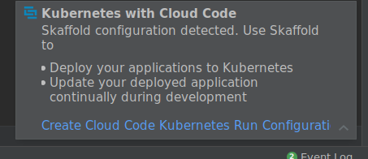
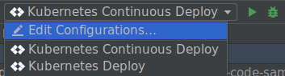
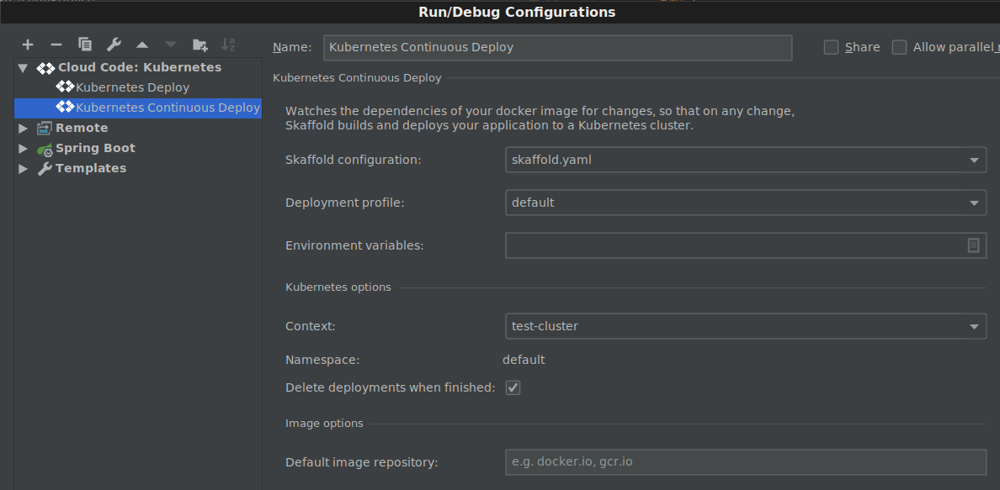
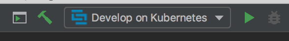
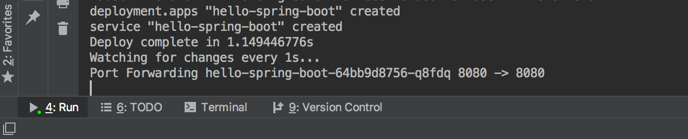
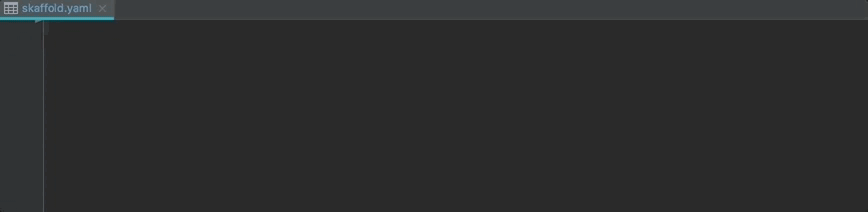

[](http://github.com/badges/stability-badges)

# Kubernetes


This plugin adds support for [Kubernetes](https://www.kubernetes.io) development into the [JetBrains family of IDEs](https://www.jetbrains.com/products.html), including IntelliJ (both Community and Ultimate editions), GoLand, PyCharm, WebStorm (and others).

# Table Of Contents

 * [Features](#features)
  * [Prerequisites and required dependencies](#prerequisites-and-required-dependencies)
  * [Installing the plugin into your IDE](#installing-the-plugin-into-your-ide)
  * [Frequently asked questions](#frequently-asked-questions-faq)
  * [Getting started](#getting-started)
     * [Specifying image repository](#specifying-image-repository)
     * [Continuous development on Kubernetes](#continuous-development-on-kubernetes)
        * [Adding new features](#adding-new-features)
     * [Deployment to Kubernetes](#deployment-to-kubernetes)
  * [Setup existing Kubernetes projects with the plugin](#setup-existing-kubernetes-projects-with-the-plugin)


## Features

* One click **deployment to Kubernetes clusters right from your IDE** using [Skaffold](https://skaffold.dev/docs/getting-started/). Configure Skaffold to use your desired build and deployment strategies: works with kubectl, Helm, Google Cloud Build (for remote builds), Jib and Kanico.
* **Continuous development on Kubernetes**. Watches the dependencies of your docker image or Jib Java project for changes, so that on any change, Skaffold builds and deploys your application to a Kubernetes cluster.
* Automatic discovery and support for project with existing Skaffold configuration, in any language supported by your preferred JetBrains IDE.
* Skaffold configuration file **editing support and smart templates**.

## Prerequisites and required dependencies

This plugin uses familiar Kubernetes and container tools to bring you a rich Kubernetes experience in IntelliJ and other JetBrains IDEs. 

The following tools are expected to be installed and setup on your system and available in the system path:

* JetBrains IDE version 2018.2+, either Ultimate or Community editions.
* [kubectl](https://kubernetes.io/docs/tasks/tools/install-kubectl/) for working with Kubernetes clusters and managing Kubernetes deployments.
* [Skaffold](https://skaffold.dev/docs/getting-started/) to support continuous development on a Kubernetes cluster, smart image building and tagging, and an array of supported deployment and build types.
* [Docker](https://www.docker.com/) for building and pushing your container images. *Note*: Docker is optional if you are using [Jib to build your container images](https://github.com/GoogleContainerTools/jib).
* Configured Kubernetes cluster. It could be a cluster for local development, such as [Minikube](https://kubernetes.io/docs/setup/minikube/) or [Docker Kubernetes](https://docs.docker.com/docker-for-mac/kubernetes/) cluster, or remote cluster, such as [Google Kubernetes Engine](https://cloud.google.com/kubernetes-engine/) cluster. We recommend [Minikube](https://kubernetes.io/docs/setup/minikube/) cluster for local development.

## Installing the plugin into your IDE

If you'd like to try out the Kubernetes features, you can install the nightly release:

1) Copy this URL:<br />
   `https://plugins.jetbrains.com/plugins/nightly/8079`
2) Use the copied URL to add a Custom Plugin URL, following [these instructions](https://www.jetbrains.com/idea/help/managing-enterprise-plugin-repositories.html)
3) Search for the `Google Cloud Tools` plugin and install it


## Frequently Asked Questions (FAQ)
See the [Google Cloud Tools Kubernetes FAQ](docs/faq.md).

## Getting started

The plugin works in any of the  [JetBrains family of IDEs](https://www.jetbrains.com/products.html). The following shows an example using Kubernetes with Java and Spring Boot in IntelliJ IDEA (Community or Ultimate editions). Follow the installation steps above to install the plugin. Restart your IDE if prompted to activate the plugin.

Before we start, make sure [all required dependencies](https://github.com/GoogleCloudPlatform/google-cloud-intellij/tree/master/kubernetes#prerequisites-and-required-dependencies) are available on your machine.

Clone the repository to your local machine to get your copy of the repository:
```
git clone https://github.com/GoogleCloudPlatform/google-cloud-intellij.git
```

Open the `hello-spring-boot` example project in your IDE. It is located in the `kubernetes/examples/hello-spring-boot` directory in the project you just cloned. The project opens and loads:

 

This project is a simple web application created with [the popular Spring Boot framework](https://spring.io/projects/spring-boot). It uses the [Jib Maven plugin](https://github.com/GoogleContainerTools/jib) to build a container image for the project, without needing to create a Dockerfile.

Once the project loads, the plugin will detect the Skaffold configuration and prompt to create the Kubernetes targets. The notification shows (if it disappears, you can find it in the Event Log in the bottom right of the IDE):

 

Click `Create run configurations for Kubernetes with Skaffold` link to automatically create Kubernetes deployment and continuous development IDE run targets for the project:

 

Now the new run targets can be used to build the project and deploy it to Kubernetes or develop on Kubernetes cluster continuously. With continuous development, the plugin uses Skaffold to watch the sources and dependencies of your project for changes, so that on any change, Skaffold builds and deploys your application to a Kubernetes cluster.

### Specifying image repository

However, before we can deploy and develop, we need to make sure we have access to the image repository where the project image is about to be pushed. By default the project is configured to use [Google Container Registry](https://cloud.google.com/container-registry/) and a development project for the plugin which you probably don’t have access to. Once you have your repository set up ([Google Container Registry](https://cloud.google.com/container-registry/), [DockerHub](https://hub.docker.com/), private repository, etc.), you can edit the run targets and specify it as a *default image repository* in run target settings:



Here are examples of how to specify the default image repository for some common registries:

* Docker Hub: `docker.io/{account}`
* GCP Container Repository (GCR): `gcr.io/{project_id}`
* AWS Container Repository (ECR): `{aws_account_id}.dkr.ecr.{region}.amazonaws.com/{my-app}`
* Azure Container Registry (ACR): `{my_acr_name}.azurecr.io/{my-app}`

The resulting image name is concatenated from the specified default image repository and the image name from the project Kubernetes resources. For this `hello-spring-boot` example, and GCR image repository as the default one, the resulting full image name would be `gcr.io/{project_id}/gcr.io/gcp-dev-tools/hello-spring-boot`. 

*Note*: this step is not required when you work with your own Kubernetes manifests and Skaffold configuration where you specify a repository and an image name that are accessible to you.

### Continuous development on Kubernetes

Now you can set up a continuous development iteration cycle in your IDE. Click the run action for `Develop on Kubernetes` to start development cycle on your Kubernetes cluster:

 

The development cycle initiates and console window with the logs opens. The plugin uses Skaffold to build an image for the project, tag it, push it to the configured repository, and then uses `kubectl` to deploy the project Kubernetes manifests:


Once the build completes, the image is pushed and deployment starts, the console begins to stream logs from your Kubernetes deployment:


As you can see, Spring Boot application initializes and launches built-in web server. Be default, Spring Boot web server uses port 8080 to serve the content. The plugin makes sure you don’t have to worry about accessing the deployment via remote addresses - all declared container ports are port-forwarded automatically!



Navigate your browser to [localhost:8080](http://localhost:8080) to access the Spring Boot application running on your Kubernetes cluster. Alternatively, use `curl` command to interact with the application:

 

```
$ curl localhost:8080
Hello, World of Kubernetes with IntelliJ!
```

You can check the details of the Kubernetes deployment and service using standard Kubernetes CLI commands (`kubectl get deploy`, etc.) or using Kubernetes dashboard for your Kubernetes cluster. The Kubernetes resources for the project are located in the `k8s` directory - there is one deployment and one service YAML file.

#### Adding new features

Now, let’s add more features to our Spring Boot project and see how they get deployed to your Kubernetes cluster without stopping and removing the deployment, manually building and tagging the image, or updating the cluster. Open `HelloController.java` file from `src` and add a new HTTP request mapping:

```java
   @RequestMapping("/greeting")
    public String greeting(@RequestParam(value="name", defaultValue="World") String name) {
        return String.format("Hello from Kubernetes with IntelliJ, %s!", name);
    }
```

Save the changes (`Ctrl-S`) or build the project (use `Build -> Build Project` menu or the toolbar icon). The plugin picks up the changes, re-builds the project and image, and deploys the updated image to your Kubernetes cluster. You can watch the progress and deployment logs in the console window. Once the changes are propagated, we can confirm the updates by visiting the newly created endpoint at [localhost:8080/greeting?name=User](http://localhost:8080/greeting?name=User):


```
$ curl localhost:8080/greeting?name=User
Hello from Kubernetes with IntelliJ, User!
```

You can continue adding and testing new features and have them redeployed automatically to your Kubernetes cluster from your IDE on every change. Once you are finished, click `stop` to end the continuous development session. The plugin deletes all Kubernetes resources used for the development session.

### Deployment to Kubernetes

You can use the other Kubernetes run target to build the image and deploy the project to your Kubernetes cluster once. Unlike continuous development, your project sources and dependencies are not watched, and the Skaffold process finishes once the image and deployment are complete.

 

## Setup existing Kubernetes projects with the plugin

You can open any existing project already configured with Kubernetes manifests and a Dockerfile (or [Jib](https://github.com/GoogleContainerTools/jib)), and use it with the plugin. The only additional bit of configuration is a Skaffold YAML file that you can create from a provided template. Here is a quick tutorial:
* Create new file named `skaffold.yaml` in the root directory of your project (right-click -> `New` -> `File`).
* Type `skaffold` and accept proposed Skaffold live template:


* Populate `image` field with your project image name and `manifests` field with a list of your Kubernetes resources you'd like to be deployed from the IDE. 
   * Example for Dockerfile based builds:
   ```
   build:
     artifacts:
       - image: gcr.io/gcp_project_id/image_name
   deploy:
     kubectl:
       manifests:
         - k8s/web.yaml
         - k8s/backend.yaml
   ```
   * Example `build` section for Java Maven/Gradle projects with the [Jib plugin](https://github.com/GoogleContainerTools/jib) (`deploy` section stays the same):
   ```
   build:
     artifacts:
     - image: gcr.io/gcp_project_id/image_name
       jibMaven: {}
   ```
  
* Once `skaffold.yaml` is valid, the plugin will prompt you to create Kubernetes run targets automatically:
 

 
