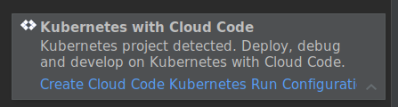
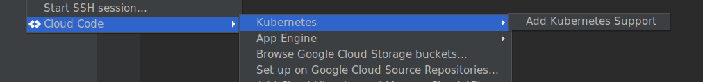

# Set up existing Kubernetes projects with the plugin

You can open any existing project already configured with Kubernetes manifests and a Dockerfile (or [Jib](https://github.com/GoogleContainerTools/jib)), and use it with the plugin. The only additional bit of configuration is a Skaffold YAML file which can be either generated for you automatically or you can create it from a provided template. 

## Automatic project bootstrapping

If your project has Dockerfile and Kubernetes resources, Cloud Code will prompt you with a notification to automatically create this configuration. Once created, your project is ready to use the Cloud Code Kubernetes continuous development and deployment features.



Alternatively, `Tools` -> `Cloud Code` -> `Kubernetes` -> `Add Kubernetes Support` menu can be used to analyze the project Kubernetes resources, generate Skaffold configuration, and add two run configurations for deployment and continuous deployment to a Kubernetes cluster. After support is added, you can immediately start deploying and debugging your project on Kubernetes using the newly added run configurations.



## Manually creating Cloud Code Skaffold configuration

Here is a quick tutorial:
* Create new file named `skaffold.yaml` in the root directory of your project (right-click -> `New` -> `File`).
* Type `skaffold` and accept proposed Skaffold live template:


* Populate `image` field with your project image name and `manifests` field with a list of your Kubernetes resources you'd like to be deployed from the IDE. 
   * Example for Dockerfile based builds:
   ```
   build:
     artifacts:
       - image: gcr.io/gcp_project_id/image_name
   deploy:
     kubectl:
       manifests:
         - k8s/web.yaml
         - k8s/backend.yaml
   ```
   * Example `build` section for Java Maven/Gradle projects with the [Jib plugin](https://github.com/GoogleContainerTools/jib) (`deploy` section stays the same):
   ```
   build:
     artifacts:
     - image: gcr.io/gcp_project_id/image_name
       jibMaven: {}
   ```
  
* Once `skaffold.yaml` is valid, the plugin will prompt you to create Kubernetes run targets automatically:
 


Note that you can use the built-in IDE editing and quick documentation support to gain insights into allowed field and values for the generated Skaffold YAML file.
