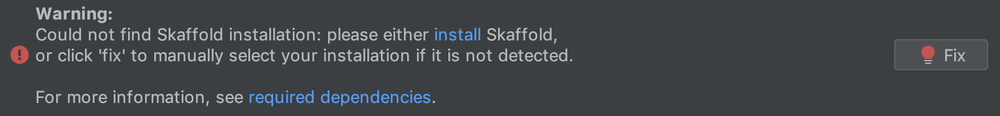
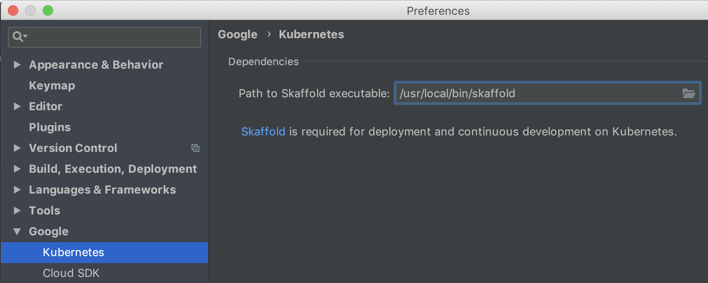
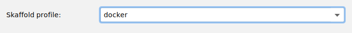

## Frequently Asked Questions (FAQ)

If you have a question that is not answered below, please [submit an issue](https://github.com/GoogleCloudPlatform/google-cloud-intellij/issues).

[How do I fix missing Skaffold installation errors?](#how-do-i-fix-missing-skaffold-installation-errors)\
[How do I fix 'executable not found on PATH' errors?](#how-do-i-fix-executable-not-found-on-path-errors)\
[How do I fix Maven wrapper errors in the hello-world example project?](#how-do-i-fix-maven-wrapper-errors-in-the-hello-world-example-project)


### How do I fix missing Skaffold installation errors? 

[Skaffold](https://skaffold.dev/) is a tool required by the Cloud Tools plugin for Kubernetes 
deployment and continuous development. The plugin attempts to find the Skaffold binary on the system 
PATH. If you don't have Skaffold installed, or the plugin simply could not detect the installation 
(possibly due to [PATH issues](#how-do-i-fix-executable-not-found-on-path-errors)), you may see the 
follow error in the Run Configuration:



To fix this, either
1) [Install Skaffold](https://skaffold.dev/docs/getting-started/#installing-skaffold) and ensure that it is added to the PATH.
2) Ensure the Skaffold executable name is `skaffold` on Linux and Mac systems, or `skaffold.exe` on Windows.
3) If Skaffold is installed and it is still not detected, visit `Settings > Google > Kubernetes`, 
and manually browse to the executable:



### How do I fix 'executable not found on PATH' errors?

If, during deployment or continuous development, you are getting errors in the form of 
`executable file not found in $PATH`, for example:
```
time="2018-11-01T12:46:38-04:00" level=fatal msg="exiting dev mode because the first build failed: building [gcr.io/**/my-proj]: tagging: pushing: getting auth config for gcr.io/**/my-proj:3c275201-dirty-50f870d: getting auth config: error getting credentials - err: exec: \"docker-credential-gcr\": executable file not found in $PATH, out: ``"
```

then you may be running into the problem where the IDE is not inheriting the shell environment variables. 
This can happen in some Linux environments when the PATH variables are defined in `.bash_profile` or `.bash_rc`
and the IDE is launched from the GUI, causing the IDE not to see the PATH variables.

While, unfortunately, there isn't an optimal solution, the following are a couple workarounds in Linux: 

- Launch the IDE from the terminal

   First, follow [these](https://www.jetbrains.com/help/idea/working-with-the-ide-features-from-command-line.html)
   instructions to enable a command-line launcher. Then launch the IDE from the terminal.

   For example, to launch IntelliJ IDEA from the terminal, navigate to the project you 
   wish to open, then execute:

   `idea .`

   Similarly, to launch PyCharm, execute:

   `charm .`

Or,
- Set the the PATH variables in a system-wide location such as `/etc/environment`.

### How do I fix Maven wrapper errors in the hello-world example project?

If you are getting errors in the form:

```
time="2019-03-08T11:13:45-05:00" level=fatal msg="watching files for artifact gcr.io/gcp-dev-tools/hello-spring-boot: listing files: 
listing files: getting jibMaven dependencies: unable to stat file Found \"C:\\Users\\***\\google-cloud-intellij\\kubernetes\\examples\\hello-spring-boot\\.mvn\\wrapper\\maven-wrapper.jar\": CreateFile Found \"C:\\Users\\***\\google-cloud-intellij\\kubernetes\\examples\\hello-spring-boot\\.mvn\\wrapper\\maven-wrapper.jar\": The filename, directory name, or volume label syntax is incorrect."
```

Then you may be running into [this known issue](https://github.com/GoogleCloudPlatform/google-cloud-intellij/issues/2427).

As a workaround in the [Spring Boot hello-world project](https://github.com/GoogleCloudPlatform/google-cloud-intellij/tree/master/kubernetes/examples/hello-spring-boot) 
you can change the Skaffold project from the `default` project to the `docker` profile in your Kubernetes Run Configuration:


